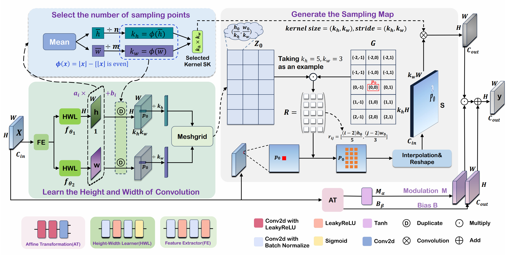

<div align=center>
  
# **[CVPR 2025]** Adaptive Rectangular Convolution for Remote Sensing Pansharpening

<p>
<a href='https://arxiv.org/abs/2503.00467'></a>
<a href='None'></a>
</p>

</div>

<div align=center>

</div>

Abstract: Recent advancements in convolutional neural network (CNN)-based techniques for remote sensing pansharpening have markedly enhanced image quality. However, conventional convolutional modules in these methods have two critical drawbacks. First, the sampling positions in convolution operations are confined to a fixed square window. Second, the number of sampling points is preset and remains unchanged. Given the diverse object sizes in remote sensing images, these rigid parameters lead to suboptimal feature extraction. To overcome these limitations, we introduce an innovative convolutional module, Adaptive Rectangular Convolution (ARConv). ARConv adaptively learns both the height and width of the convolutional kernel and dynamically adjusts the number of sampling points based on the learned scale. This approach enables ARConv to effectively capture scale-specific features of various objects within an image, optimizing kernel sizes and sampling locations. Additionally, we propose ARNet, a network architecture in which ARConv is the primary convolutional module. Extensive evaluations across multiple datasets reveal the superiority of our method in enhancing pansharpening performance over previous techniques. Ablation studies and visualization further confirm the efficacy of ARConv. The source is available at [github](https://github.com/WangXueyang-uestc/ARConv).

## 🛠 Getting started

### Setup environment

1. clone the repository

```bash
git clone git@github.com:WangXueyang-uestc/ARConv.git
cd ARConv
```
2. install dependencies

```bash
pip install -r requirements.txt
```

### Prepare dataset

Datasets can be downloaded from the repo [liangjiandeng/PanCollection](https://github.com/liangjiandeng/PanCollection). Remember to replace `PATH TO TRAIN DATASET` in `.scripts` with the path to the dataset.

## 🚀 Train the model

```bash
bash .scripts/train_{Datasets}.sh
```

## 👍 Additional Information

**Weights:**
- You can downloaded our trained weights from https://pan.baidu.com/s/1xFWSLX9611E2CukCpnOp1w?pwd=37ic.

**Metrics:**
- MetricCode can be found [here](https://github.com/WangXueyang-uestc/ARConv/tree/main/MetricCode).
- You can alse use the tools from [liangjiandeng/DLPan-Toolbox](https://github.com/liangjiandeng/DLPan-Toolbox) (specifically, the `02-Test-toolbox-for-traditional-and-DL(Matlab)` directory).

**Parameter Count:**
- Since we have pre-initialized all the convolutional kernels in the model, directly computing the parameter quantity would be huge and unreasonable. This is because only a small part of them is involved in each step of update. Therefore, if you want to know about the parameter quantity of the model, please calculate the parameters of the used convolutional kernels after fixing the number of convolutional kernel sampling points.

## :e-mail: Contact

If you have any questions, please email [`xywang_uestc@std.uestc.edu.cn`](mailto:xywang_uestc@std.uestc.edu.cn).

